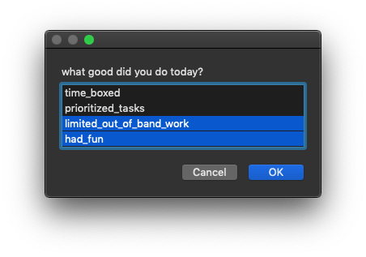

# For the goals
  
A popup at the end of your day which builds a spreadsheet.  
Select as many (or as few) you deserve.



I am poor at remembering to spend time in consideration of how I spend my time  
So I spent some time on this bit of bash that runs a bit of applescript that runs a bit of bash  
Now I dont have to spend time on that anymore  
I probably will anyway though  
  
  
  
```bash
# run on a cron

0 16 * * 1-5 cd $HOME/src/introspection && /usr/local/bin/gtimeout 3600 ./ask_myself
```
<sub>brew install core-utils for gtimeout</sub>
  
##### TODO  
- [ ] automate shipping this to [google sheets w go](https://developers.google.com/sheets/api/quickstart/go)  
  
---
[relevant xkcd](https://xkcd.com/1319/)
  
